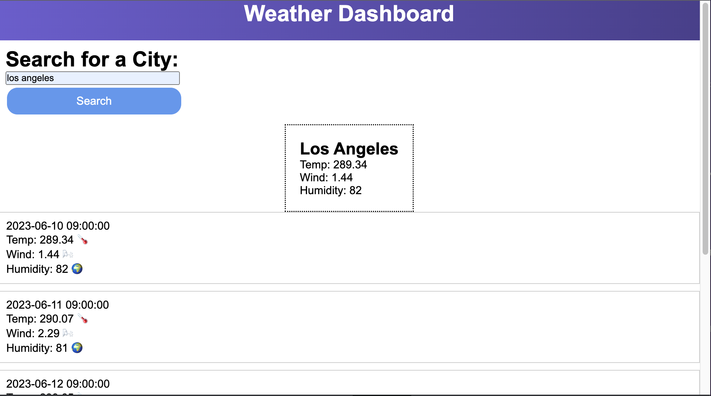

# API-Weather-Dashboard :earth_americas:

A server side API weather dashboard, that provides 5-day weather forecast. 

## Features :partly_sunny:

* Search for a city to get the current weather information and a 5-day forecast.
* Displays the city name, temperature, wind speed, and humidity for the current weather.
* Shows a forecast for each day of the 5-day forecast, including the date, temperature, wind speed, and humidity.
Uses dynamic HTML and CSS to update the weather information in real-time.

## Technologies Used :test_tube:

-HTML
-CSS
-JavaScript 

## Author :writing_hand:

GitHub - github.com/Ashmo91388

